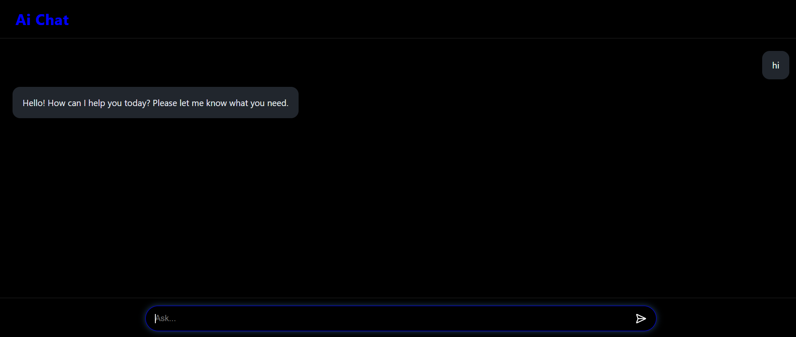

# AI Chat App (React + Gemini API)

A simple AI chat application built with React that uses Google Gemini API to generate responses. The project demonstrates how to build a ChatGPT-like interface using React Context API for state management.

---

## Features

- User and AI message separation
- React Context API for global state management
- Gemini API integration for AI responses
- Responsive UI design

---

## Tech Stack

- React
- JavaScript 
- Context API
- Google Gemini API
- CSS

